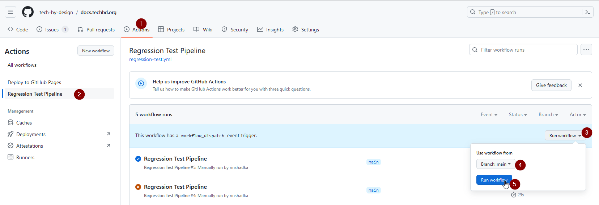

# 1115 Waiver HRSN Screening Assurance Results

## Overview
This repository includes a manual executable GitHub Actions workflow specifically designed for regression testing. Users can execute this workflow to validate changes and ensure the integrity of updates.

## Running the Regression Tests
To run the regression tests, you can trigger the manual GitHub Actions workflow available in this repository. The results of the tests are structured and stored as follows:

- Source files: `regression-test-prime/fhir-service-prime/src`
- Test results: `regression-test-prime/fhir-service-prime/results/YYYY/MM/YYYY-MM-DD-HH-MM-SS`

Below is a screenshot illustrating how to manually execute this workflow:

This screenshot provides a visual guide to running the regression tests, showing the necessary steps and expected outputs.

## Directory Structure
The repository maintains a clear directory structure for ease of navigation and management:
- **Source Directory**: Contains all source files necessary to run the tests.
- **Results Directory**: Stores test results in a timestamped folder format, allowing easy tracking of test executions over time.
