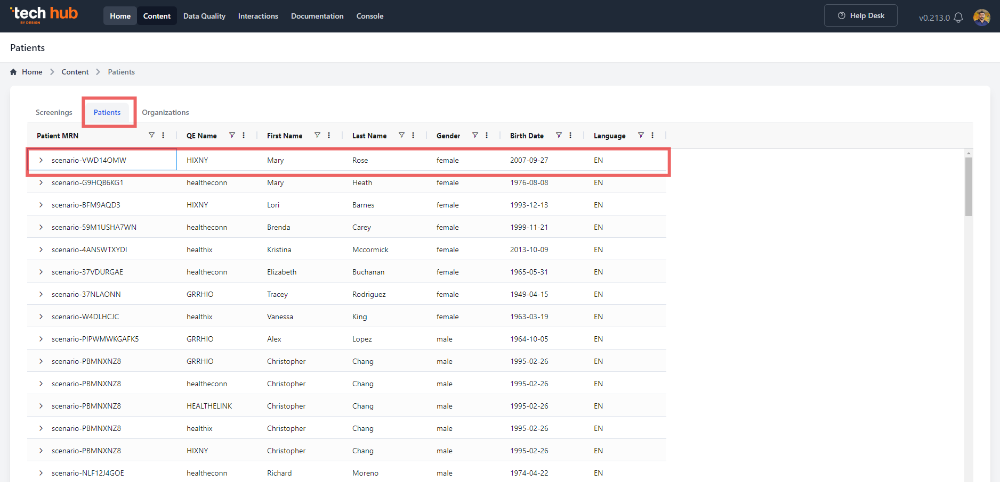
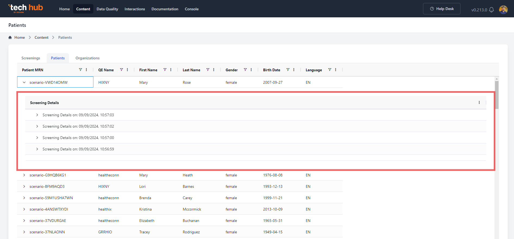
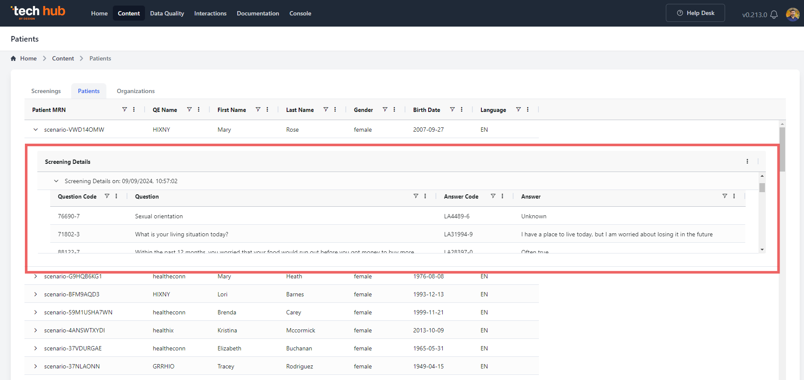

#### Patients Screen Overview

The **Patients** screen provides a top-level menu to manage and review FHIR submissions grouped by each patient’s MRN. This screen offers a clear, organized list of all patients, and for each patient, users can drill down into detailed records of the associated screenings.

#### First-Step Drill-Down: Screening Records by Patient MRN

Once a patient is selected, users are presented with a list of **Screening Records** for that patient. These records summarize all screening activities related to the specific patient, allowing users to quickly assess the status and history of each submission.

#### Second-Step Drill-Down: Screening Details

For every **Screening Record**, users can access an additional drill-down that provides comprehensive details about that particular screening. This includes:

- **Observation Screening Records**: A summary of observations recorded during the screening process.
- **Questions and Answers**: A detailed view of the questions asked during the screening, along with the user-submitted answers.

This multi-level navigation allows users to thoroughly review and validate both high-level summaries and detailed submission data. The structured layout ensures that screening records and responses are captured and stored accurately, enhancing both usability and efficiency.