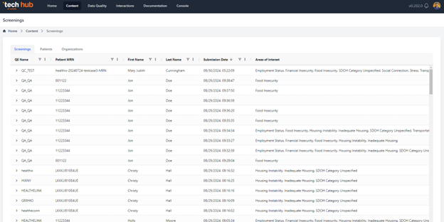
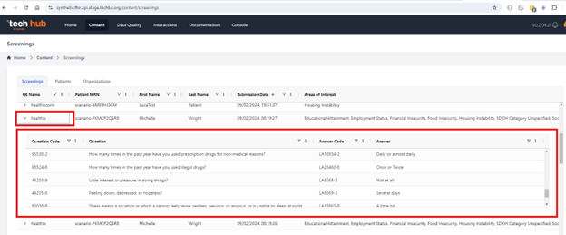

#### Screening Overview

The Screening screen provides a detailed overview of all FHIR submissions, offering users a clear and organized list of each submission. For every entry in the list, users can access a drill-down feature that reveals comprehensive details related to that specific submission.

#### Drill-Down Details

When drilling down into a submission, users can view:

- **Observation Screening Records**: A summary of observations made during the screening process.
- **Questions and Answers**: A detailed display of the questions asked during the screening, along with the answers that the user submitted.

This screen allows users to thoroughly review and validate the submitted data, ensuring that all screening records and responses are accurately captured and stored.
