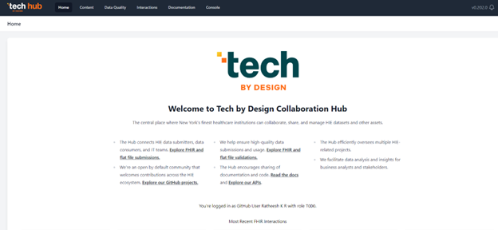
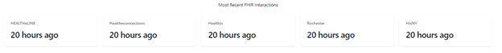
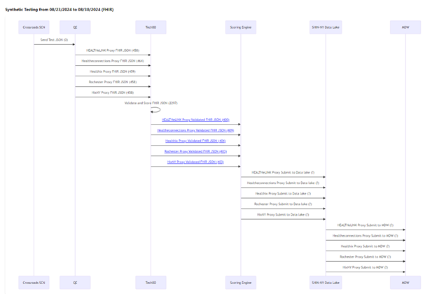

The collection of widgets is designed to help QE executives and staff members efficiently manage and monitor FHIR submissions. These widgets provide real-time tracking, status updates, and detailed analysis, ensuring accurate processing and compliance. The widgets provide a comprehensive view of submission statuses, identify and resolve errors promptly, optimize workflow performance, and enhance communication with SCNs.

By delivering actionable insights and detailed reports, the widgets support strategic decision-making and continuous improvement in the submission process. Additionally, the widgets provide users with clear visibility into processing times, error trends, and overall submission quality.

#### Most Recent FHIR Interactions

#### Most Recent Flat Files SFTP egress Interactions

#### FHIR Submission Overview

This widget compares the count of incoming synthetic files at each stage in the data processing pipeline, from the SCN to the QE, then to the Scoring Engine, SHIN-NY Data Lake, and finally to the MDW. It provides a clear view of data movement and processing consistency, highlighting discrepancies or drop-offs in the number of files between stages. This comparison helps in identifying potential issues and ensures the integrity of the data flow across the system.

#### Needs Attention Widget

**Objective:**
- **Primary Goal**: Provide a quick and clear view of the data movement across the FHIR data processing pipeline.
- **Focus**: Highlight discrepancies or drop-offs in the number of files at different stages (SCN, QE, Scoring Engine, SHIN-NY Data Lake, MDW).
- **Purpose**: Enable users to identify and address potential issues early, ensuring data integrity, consistency, and smooth flow across the entire system.

**Jobs to Be Done (JTBD):**
- **Job**: Help users quickly identify and address issues in the FHIR data processing pipeline by tracking and comparing synthetic file counts at each stage (SCN, QE, Scoring Engine, SHIN-NY Data Lake, MDW).
- **Outcome**: Ensure data consistency and integrity by detecting discrepancies or drop-offs in file counts between stages, allowing users to proactively resolve issues before they impact downstream processes.

Together, the objective and JTBD of the widget focus on providing actionable insights to maintain the health of the data flow from submission to destination.

